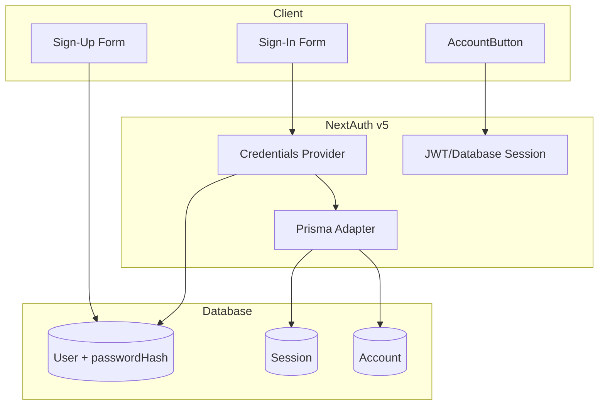

# Clerk to NextAuth In-House Authentication Migration

## Current State

- **Clerk** used in: [src/middleware.ts](src/middleware.ts), [src/app/layout.tsx](src/app/layout.tsx), [src/lib/queries.ts](src/lib/queries.ts), [src/components/AccountButton.tsx](src/components/AccountButton.tsx), sign-in/sign-up pages, root/agency pages, navigation
- **Prisma** User model at [prisma/schema.prisma](prisma/schema.prisma) has `id`, `name`, `avatarUrl`, `email`, `agencyId`, `role` but no password field
- **Auth flow**: Root redirects unauthenticated to `/site`, authenticated to `/agency`; agency routes redirect to `/agency/sign-in` when unauthenticated

## Target Architecture

## Implementation Plan

### 1. Schema Changes (Prisma)

Extend [prisma/schema.prisma](prisma/schema.prisma):

- **User model**: Add `passwordHash String?`, `emailVerified DateTime?`, `image String?` (map to `avatarUrl` for Auth.js compatibility). Add relations: `accounts Account[]`, `sessions Session[]`.
- **New models** (Auth.js Prisma adapter): `Account`, `Session`, `VerificationToken` per [Auth.js Prisma schema](https://authjs.dev/reference/adapter/prisma).
- Keep existing User fields (`agencyId`, `role`, `Permissions`, etc.) for domain logic.

Run migration after schema update.

### 2. Dependencies

**Remove:**

- `@clerk/nextjs`
- `@clerk/themes`

**Add:**

- `next-auth@beta` (Auth.js v5)
- `@auth/prisma-adapter`
- `bcryptjs` (password hashing)
- `@types/bcryptjs` (dev)

### 3. Auth Configuration

Create `src/auth.ts`:

- Use `PrismaAdapter(db)` for session storage.
- Add **Credentials provider** with `authorize()`:
  - Look up user by email in Prisma.
  - Verify password with `bcrypt.compare()`.
  - Return user object (`id`, `name`, `email`, `image`).
- Use `database` session strategy (or `jwt` if edge compatibility is needed).
- Export `handlers`, `auth`, `signIn`, `signOut`.

Create `src/app/api/auth/[...nextauth]/route.ts`:

- Export `GET` and `POST` from `handlers`.

### 4. Session Provider

Create `src/components/providers/session-provider.tsx`:

- Wrap children with `SessionProvider` from `next-auth/react` (client component).
- Add to [src/app/layout.tsx](src/app/layout.tsx), replacing `ClerkProvider`.

### 5. Middleware

Replace [src/middleware.ts](src/middleware.ts):

- Remove `clerkMiddleware`.
- Use `auth` from `auth.ts` as middleware (or `export { auth as middleware }`).
- Keep existing matcher; protect `/agency` routes (redirect to `/agency/sign-in` when unauthenticated).

### 6. Custom Auth Pages

**Sign-in** ([src/app/(main)/agency/(auth)/sign-in/[[...sign-in]]/page.tsx](src/app/(main)/agency/(auth)/sign-in/[[...sign-in]]/page.tsx)):

- Replace Clerk `<SignIn />` with custom form: email, password, submit.
- Use `signIn("credentials", { email, password, redirect: true, callbackUrl })` from `next-auth/react`.
- Add error handling for invalid credentials.

**Sign-up** ([src/app/(main)/agency/(auth)/sign-up/[[...sign-up]]/page.tsx](src/app/(main)/agency/(auth)/sign-up/[[...sign-up]]/page.tsx)):

- Replace Clerk `<SignUp />` with custom form: name, email, password, confirm password.
- Create API route `POST /api/auth/signup` (or server action) that:
  - Validates input (Zod).
  - Checks email uniqueness.
  - Hashes password with `bcrypt.hash()`.
  - Creates User in Prisma with `passwordHash`, `name`, `email`, `avatarUrl: ""`.
  - Redirects to sign-in or auto sign-in via `signIn("credentials", ...)`.

### 7. Component Updates

**AccountButton** ([src/components/AccountButton.tsx](src/components/AccountButton.tsx)):

- Use `useSession()` from `next-auth/react`.
- When unauthenticated: render link/button to `/agency/sign-in`.
- When authenticated: render dropdown (avatar, name, Sign Out) using shadcn `DropdownMenu`; call `signOut()` on sign out.

**Navigation** ([src/components/site/navigation/index.tsx](src/components/site/navigation/index.tsx)):

- Remove `User` import from `@clerk/nextjs/server`.
- Remove unused `user` prop or type it as NextAuth `Session["user"]`.

### 8. Server-Side Auth Usage

Replace `currentUser()` from Clerk with `auth()` from NextAuth:

| File                                                             | Change                                                                         |
| ---------------------------------------------------------------- | ------------------------------------------------------------------------------ |
| [src/app/page.tsx](src/app/page.tsx)                             | `const session = await auth()`; redirect based on `session?.user`              |
| [src/app/(main)/agency/page.tsx](src/app/(main)/agency/page.tsx) | Same pattern                                                                   |
| [src/lib/queries.ts](src/lib/queries.ts)                         | `auth()` instead of `currentUser()`; use `session?.user?.email` for DB lookups |

### 9. Fix queries.ts

[src/lib/queries.ts](src/lib/queries.ts) has existing bugs (syntax errors, typos). During migration:

- Remove `EmailAddress` import from Clerk.
- Replace `currentUser()` with `auth()`.
- Fix `saveActivityLogsNotifications` (invalid destructuring, `ser` vs `user`, `imagUrl` vs `imageUrl`).
- Fix `verifyAndAcceptInvitation` (`currentUser` should be `currentUser()`, correct property names).

### 10. Layout and Config

- [src/app/layout.tsx](src/app/layout.tsx): Remove `ClerkProvider`, add `SessionProvider`.
- [next.config.mjs](next.config.mjs): Remove `img.clerk.com` from `images.domains` (no longer needed).

### 11. Environment Variables

**Remove:** `NEXT_PUBLIC_CLERK_*`, `CLERK_*` (if any).

**Add:**

- `AUTH_SECRET` (generate via `npx auth secret`).
- `NEXTAUTH_URL` (e.g. `http://localhost:3000` for dev).

---

## Data Migration (Existing Users)

If there are existing users in the database created via Clerk:

- They will not have `passwordHash`; they cannot sign in with credentials.
- Options: (a) Require password reset flow for existing users, or (b) One-time migration script to set temporary passwords and send reset emails (requires email infra).

If starting fresh, no migration needed.

---

## File Summary

| Action | Path                                                           |
| ------ | -------------------------------------------------------------- |
| Modify | `prisma/schema.prisma`                                         |
| Create | `src/auth.ts`                                                  |
| Create | `src/app/api/auth/[...nextauth]/route.ts`                      |
| Create | `src/app/api/auth/signup/route.ts` (or server action)          |
| Create | `src/components/providers/session-provider.tsx`                |
| Modify | `src/middleware.ts`                                            |
| Modify | `src/app/layout.tsx`                                           |
| Modify | `src/app/(main)/agency/(auth)/sign-in/[[...sign-in]]/page.tsx` |
| Modify | `src/app/(main)/agency/(auth)/sign-up/[[...sign-up]]/page.tsx` |
| Modify | `src/components/AccountButton.tsx`                             |
| Modify | `src/components/site/navigation/index.tsx`                     |
| Modify | `src/app/page.tsx`                                             |
| Modify | `src/app/(main)/agency/page.tsx`                               |
| Modify | `src/lib/queries.ts`                                           |
| Modify | `next.config.mjs`                                              |
| Modify | `package.json`                                                 |

---

## Optional Enhancements (Post-MVP)

- **Password reset**: Forgot password flow with `VerificationToken` and email.
- **Email verification**: Send verification link on sign-up.
- **OAuth providers**: Add Google/GitHub via Auth.js providers (uses `Account` model).
- **Rate limiting**: Protect sign-in/sign-up from brute force.

