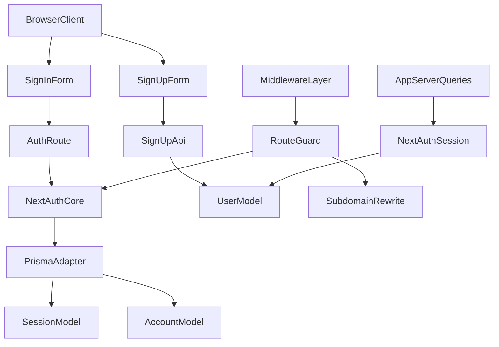

# Clerk to NextAuth Migration Plan

## Assumptions Used (because scope options were skipped)

- Implement **in-house email/password auth first** (no OAuth in phase 1).
- Handle existing Clerk-era users by **password setup/reset** flow (no Clerk hybrid runtime).
- Preserve current product behavior (agency/subaccount RBAC, invitation flow, subdomain middleware rewrites).

## Current Blockers Confirmed

- Clerk imports still exist across app and middleware while Clerk packages are absent from `package.json`, which can break clean installs and Vercel builds.
- NextAuth setup is partial: `[/home/amansharma/Desktop/DevOPS/web-builder-test-app/src/auth.ts](/home/amansharma/Desktop/DevOPS/web-builder-test-app/src/auth.ts)` uses database sessions but does not wire `PrismaAdapter`.
- Prisma user auth fields/models are incomplete in `[/home/amansharma/Desktop/DevOPS/web-builder-test-app/prisma/schema.prisma](/home/amansharma/Desktop/DevOPS/web-builder-test-app/prisma/schema.prisma)` (`passwordHash` missing; Auth.js models missing).
- Clerk-specific logic is deeply coupled in `[/home/amansharma/Desktop/DevOPS/web-builder-test-app/src/lib/queries.ts](/home/amansharma/Desktop/DevOPS/web-builder-test-app/src/lib/queries.ts)` (`currentUser`, `clerkClient`, metadata sync, invitation API).
- Middleware auth and routing are still Clerk-based in `[/home/amansharma/Desktop/DevOPS/web-builder-test-app/src/middleware.ts](/home/amansharma/Desktop/DevOPS/web-builder-test-app/src/middleware.ts)`.

## Target Architecture

## Execution Plan

### 1) Finish data model and migration foundation

- Update `[/home/amansharma/Desktop/DevOPS/web-builder-test-app/prisma/schema.prisma](/home/amansharma/Desktop/DevOPS/web-builder-test-app/prisma/schema.prisma)`:
  - `User`: add `passwordHash String?`, `emailVerified DateTime?`, and relations for auth adapter.
  - Add Auth.js models: `Account`, `Session`, `VerificationToken`.
  - Keep domain fields (`role`, `agencyId`, permissions relations) unchanged.
- Create Prisma migration and regenerate Prisma client.
- Validate no relation conflicts with existing domain entities.

### 2) Complete NextAuth/Auth.js core wiring

- Update `[/home/amansharma/Desktop/DevOPS/web-builder-test-app/src/auth.ts](/home/amansharma/Desktop/DevOPS/web-builder-test-app/src/auth.ts)`:
  - Add `PrismaAdapter(db)`.
  - Keep Credentials provider with bcrypt verification.
  - Normalize session payload (`id`, `email`, role if needed by UI/RBAC).
  - Enforce required secrets/env checks (`AUTH_SECRET`, URL).
- Keep `[/home/amansharma/Desktop/DevOPS/web-builder-test-app/src/app/api/auth/[...nextauth]/route.ts](/home/amansharma/Desktop/DevOPS/web-builder-test-app/src/app/api/auth/[...nextauth]/route.ts)` as handlers entry.

### 3) Replace Clerk middleware while preserving rewrite behavior

- Refactor `[/home/amansharma/Desktop/DevOPS/web-builder-test-app/src/middleware.ts](/home/amansharma/Desktop/DevOPS/web-builder-test-app/src/middleware.ts)`:
  - Remove `authMiddleware` from Clerk.
  - Implement NextAuth session gate for protected routes (`/agency`, `/subaccount`, selected APIs).
  - Preserve subdomain rewrite behavior and existing matcher patterns.
  - Ensure sign-in/up routes remain public and do not redirect-loop.

### 4) Replace Clerk UI/auth pages and providers

- Replace Clerk components in:
  - `[/home/amansharma/Desktop/DevOPS/web-builder-test-app/src/app/(main)/agency/(auth)/sign-in/[[...sign-in]]/page.tsx](/home/amansharma/Desktop/DevOPS/web-builder-test-app/src/app/(main)`/agency/(auth)/sign-in/[[...sign-in]]/page.tsx)
  - `[/home/amansharma/Desktop/DevOPS/web-builder-test-app/src/app/(main)/agency/(auth)/sign-up/[[...sign-up]]/page.tsx](/home/amansharma/Desktop/DevOPS/web-builder-test-app/src/app/(main)`/agency/(auth)/sign-up/[[...sign-up]]/page.tsx)
- Integrate session provider wrapper `[/home/amansharma/Desktop/DevOPS/web-builder-test-app/src/components/providers/session-provider.tsx](/home/amansharma/Desktop/DevOPS/web-builder-test-app/src/components/providers/session-provider.tsx)` into root/main layouts and remove Clerk providers in:
  - `[/home/amansharma/Desktop/DevOPS/web-builder-test-app/src/app/layout.tsx](/home/amansharma/Desktop/DevOPS/web-builder-test-app/src/app/layout.tsx)`
  - `[/home/amansharma/Desktop/DevOPS/web-builder-test-app/src/app/(main)/layout.tsx](/home/amansharma/Desktop/DevOPS/web-builder-test-app/src/app/(main)`/layout.tsx)
  - `[/home/amansharma/Desktop/DevOPS/web-builder-test-app/src/app/site/layout.tsx](/home/amansharma/Desktop/DevOPS/web-builder-test-app/src/app/site/layout.tsx)`
- Replace Clerk `UserButton` usages with local session-based UI in:
  - `[/home/amansharma/Desktop/DevOPS/web-builder-test-app/src/components/site/navigation/index.tsx](/home/amansharma/Desktop/DevOPS/web-builder-test-app/src/components/site/navigation/index.tsx)`
  - `[/home/amansharma/Desktop/DevOPS/web-builder-test-app/src/components/global/infobar.tsx](/home/amansharma/Desktop/DevOPS/web-builder-test-app/src/components/global/infobar.tsx)`

### 5) Decouple server business logic from Clerk

- Rewrite auth lookups in `[/home/amansharma/Desktop/DevOPS/web-builder-test-app/src/lib/queries.ts](/home/amansharma/Desktop/DevOPS/web-builder-test-app/src/lib/queries.ts)`:
  - Replace `currentUser()` with NextAuth session retrieval.
  - Remove `clerkClient.users.updateUserMetadata` calls.
  - Remove Clerk invitation API and keep invitation lifecycle DB-driven.
  - Replace all `emailAddresses[0].emailAddress` and `privateMetadata.role` references with DB-backed values.
- Update protected route pages/layouts using Clerk user fields:
  - `[/home/amansharma/Desktop/DevOPS/web-builder-test-app/src/app/(main)/agency/page.tsx](/home/amansharma/Desktop/DevOPS/web-builder-test-app/src/app/(main)`/agency/page.tsx)
  - `[/home/amansharma/Desktop/DevOPS/web-builder-test-app/src/app/(main)/agency/[agencyId]/layout.tsx](/home/amansharma/Desktop/DevOPS/web-builder-test-app/src/app/(main)`/agency/[agencyId]/layout.tsx)
  - `[/home/amansharma/Desktop/DevOPS/web-builder-test-app/src/app/(main)/subaccount/[subaccountId]/layout.tsx](/home/amansharma/Desktop/DevOPS/web-builder-test-app/src/app/(main)`/subaccount/[subaccountId]/layout.tsx)
  - Settings/team pages still reading Clerk fields.

### 6) Patch API/auth integrations

- Update upload authentication in `[/home/amansharma/Desktop/DevOPS/web-builder-test-app/src/app/api/uploadthing/core.ts](/home/amansharma/Desktop/DevOPS/web-builder-test-app/src/app/api/uploadthing/core.ts)` to NextAuth session checks.
- Validate signup route in `[/home/amansharma/Desktop/DevOPS/web-builder-test-app/src/app/api/auth/signup/route.ts](/home/amansharma/Desktop/DevOPS/web-builder-test-app/src/app/api/auth/signup/route.ts)` against new schema and role defaults.
- Add/finish password setup-reset flow for existing users without `passwordHash`.

### 7) Remove Clerk residue and align dependencies/env

- Remove all remaining Clerk imports/usages.
- Remove Clerk packages if still present anywhere in lock/metadata; keep `next-auth`, `@auth/prisma-adapter`, `bcryptjs`.
- Expand env documentation and validation for deployment (`AUTH_SECRET`, `NEXTAUTH_URL`, `DATABASE_URL`, existing app envs already used by Stripe/domain logic).

### 8) Deployment readiness gate for Vercel

- Run validation pipeline locally/CI:
  - Prisma validate/generate/migrate.
  - Typecheck + lint + production build.
  - Smoke tests: sign-up, sign-in, sign-out, protected route redirect, invitation acceptance, uploadthing auth, role-based access.
- Verify Vercel runtime/env parity and preview deployment before production promote.

## Definition of Done (for your “ready to deploy” question)

- No Clerk imports remain.
- Clean install + `next build` succeeds.
- Auth session persistence works with Prisma on Vercel.
- Protected routes and subdomain rewrites behave as before.
- Existing users can recover access via password setup/reset.
- Manual smoke tests pass in Vercel preview.

## Reality Check Right Now

- **Current state is not deploy-ready yet**.
- **It will not work perfectly on Vercel today** until the migration tasks above are completed and verified.

