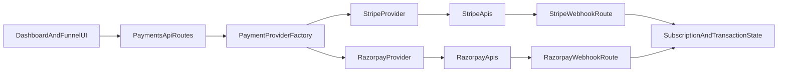

# Multi-Gateway Payments Plan (Stripe + Razorpay)

## What We Confirmed

- Core website/funnel creation flows are not blocked by payment status and already work independently in [src/lib/queries.ts](src/lib/queries.ts), [src/proxy.ts](src/proxy.ts), [src/app/(main)/agency/[agencyId]/layout.tsx](src/app/(main)/agency/[agencyId]/layout.tsx), and [src/app/(main)/subaccount/[subaccountId]/layout.tsx](src/app/(main)/subaccount/[subaccountId]/layout.tsx).
- Stripe is currently hard-wired in API/UI flows (e.g. [src/app/api/stripe/create-checkout-session/route.ts](src/app/api/stripe/create-checkout-session/route.ts), [src/app/api/stripe/create-subscription/route.ts](src/app/api/stripe/create-subscription/route.ts), [src/components/forms/subscription-form/subscription-form-wrapper.tsx](src/components/forms/subscription-form/subscription-form-wrapper.tsx), [src/app/(main)/subaccount/[subaccountId]/funnels/[funnelId]/editor/[funnelPageId]/_components/funnel-editor/funnel-editor-components/checkout.tsx](src/app/(main)/subaccount/[subaccountId]/funnels/[funnelId]/editor/[funnelPageId]/_components/funnel-editor/funnel-editor-components/checkout.tsx)).

```44:71:src/app/api/stripe/create-checkout-session/route.ts
const session = await stripe.checkout.sessions.create(
  {
    // ...line_items
    ...(subscriptionPriceExists && {
      subscription_data: {
        metadata: { connectAccountSubscriptions: 'true' },
        application_fee_percent:
          +process.env.NEXT_PUBLIC_PLATFORM_SUBSCRIPTION_PERCENT,
      },
    }),
  },
  { stripeAccount: subAccountConnectAccId }
)
```

## Target Architecture

- Add a payment abstraction layer under [src/lib/payments](src/lib/payments):
  - `types.ts`: common contracts (`PaymentGateway`, `CheckoutSessionInput`, `SubscriptionInput`, webhook payload contract).
  - `provider-factory.ts`: resolve provider by agency/subaccount config (manual setting).
  - `providers/stripe-provider.ts`: migrate existing Stripe behavior.
  - `providers/razorpay-provider.ts`: Razorpay implementation for customer, subscription, checkout, webhooks, connected-account equivalent.
- Keep Stripe-specific SDK code in [src/lib/stripe](src/lib/stripe) during migration; adapt it behind the provider interface first to reduce risk.




## Data Model and Migration

- Update [prisma/schema.prisma](prisma/schema.prisma):
  - Add `PaymentGateway` enum (`STRIPE`, `RAZORPAY`).
  - Agency-level fields for billing gateway + customer/account IDs (provider-neutral naming).
  - Subaccount-level fields for checkout/payout gateway + account IDs.
  - Subscription fields for gateway + gateway subscription ID (keep current fields temporarily for backward compatibility migration).
- Create a migration preserving existing Stripe data by mapping old fields (`connectAccountId`, `customerId`, `subscritiptionId`) into new provider-neutral fields.
- Update seed/docs consistency in [prisma/seed.js](prisma/seed.js), [prisma/SEED_README.md](prisma/SEED_README.md), and [CHANGELOG.md](CHANGELOG.md).

## API and Webhook Refactor

- Introduce provider-agnostic routes under [src/app/api/payments](src/app/api/payments):
  - `create-customer`, `create-subscription`, `create-checkout-session`, `webhook/[gateway]`.
- Keep legacy [src/app/api/stripe](src/app/api/stripe) as thin compatibility wrappers temporarily.
- Move gateway-specific event handling logic from [src/app/api/stripe/webhook/route.ts](src/app/api/stripe/webhook/route.ts) into provider handlers.
- Standardize internal response shapes (`clientSecret`, `subscriptionId`, `checkoutSessionRef`, status fields) so UI remains consistent.

## UI and Operations Changes

- Add manual gateway selectors in agency/subaccount settings screens (source of truth for provider choice).
- Billing and subscription flows:
  - Update [src/app/(main)/agency/[agencyId]/billing/page.tsx](src/app/(main)/agency/[agencyId]/billing/page.tsx) and subscription form components to call generic payment endpoints.
- Funnel checkout and product loading:
  - Update [src/app/(main)/subaccount/[subaccountId]/funnels/[funnelId]/_components/funnel-settings.tsx](src/app/(main)/subaccount/[subaccountId]/funnels/[funnelId]/_components/funnel-settings.tsx) and checkout component to load provider-specific products and sessions.
- Launchpad onboarding:
  - Generalize Stripe-only connect steps in [src/app/(main)/agency/[agencyId]/launchpad/page.tsx](src/app/(main)/agency/[agencyId]/launchpad/page.tsx), [src/app/(main)/subaccount/[subaccountId]/launchpad/page.tsx](src/app/(main)/subaccount/[subaccountId]/launchpad/page.tsx), and [src/lib/utils.ts](src/lib/utils.ts) to provider-specific onboarding links.

## Safety, Testing, and Rollout

- Ensure non-payment website operations remain ungated (explicit regression checks for funnels/pages/CRM).
- Add unit tests for provider factory + provider adapters and integration tests for each gateway webhook route.
- Roll out in phases:
  - Phase 1: abstraction + Stripe parity.
  - Phase 2: Razorpay implementation + sandbox verification.
  - Phase 3: gateway selectors + gradual tenant enablement.
  - Phase 4: remove or deprecate direct Stripe-only route usage.
- Validate env and docs updates in [.env.example](.env.example) and changelog/module documentation updates per project rules.

