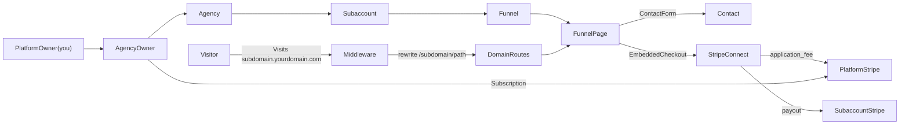

# Investor brief: what this app is (and how close to “complete”)

## What SaaS is this?

This codebase is a **multi-tenant “Agency OS” / white‑label platform** branded as **Plura**: an agency owner subscribes to the platform, creates **Subaccounts (clients)**, and each subaccount can run **funnels (landing pages + page builder)**, **collect leads**, and **take payments via Stripe Connect**, while the platform can take a **fee**.

Evidence in code:

- **Tenancy + roles**: `Agency`, `SubAccount`, `Role`, `Permissions` in `[prisma/schema.prisma](prisma/schema.prisma)`
- **Subdomain routing for hosted funnels**: host-based rewrite in `[src/middleware.ts](src/middleware.ts)`
- **Funnel builder + hosted pages**: `[src/app/(main)/subaccount/[subaccountId]/funnels/**](src/app/(main)/subaccount/[subaccountId]/funnels)` and public render routes `[src/app/[domain]/**](src/app/[domain])`
- **Platform subscription billing + Stripe Connect rebilling**: `[src/app/api/stripe/](src/app/api/stripe)`** + `[src/lib/stripe/](src/lib/stripe)`**

## Feature set (what it gives you)

- **Auth (email/password)**
  - Credentials auth via NextAuth v5 (DB sessions) in `[src/auth.ts](src/auth.ts)`
  - Sign up + sign in UI: `[src/app/(main)/agency/(auth)/sign-up/**](src/app/(main)/agency/(auth)/sign-up)` and `[src/app/(main)/agency/(auth)/sign-in/](src/app/(main)**/agency/(auth)/sign-in)`
  - Password reset (token + Resend email): `[src/app/api/auth/request-password-reset/route.ts](src/app/api/auth/request-password-reset/route.ts)` + `[src/app/api/auth/reset-password/route.ts](src/app/api/auth/reset-password/route.ts)`
- **Multi-tenant “Agency → Subaccounts” + permissions**
  - Agencies create/manage subaccounts: e.g. `[src/app/(main)/agency/[agencyId]/all-subaccounts/page.tsx](src/app/(main)/agency/[agencyId]/all-subaccounts/page.tsx)`
  - Team + invitations: `[src/app/(main)/agency/[agencyId]/team/page.tsx](src/app/(main)/agency/[agencyId]/team/page.tsx)` + invitation model in Prisma
  - Role + per-subaccount access control enforced in layouts:
    - Agency routes: `[src/app/(main)/agency/[agencyId]/layout.tsx](src/app/(main)/agency/[agencyId]/layout.tsx)`
    - Subaccount routes: `[src/app/(main)/subaccount/[subaccountId]/layout.tsx](src/app/(main)/subaccount/[subaccountId]/layout.tsx)`
- **Funnels (page builder) + publishing to subdomains**
  - Funnels and funnel pages stored in DB (`Funnel`, `FunnelPage`) and editable via `/subaccount/.../funnels/.../editor/...`
  - Page ordering, steps, and external “published URL” links: `[src/app/(main)/subaccount/[subaccountId]/funnels/[funnelId]/_components/funnel-steps.tsx](src/app/(main)/subaccount/[subaccountId]/funnels/[funnelId]/_components/funnel-steps.tsx)`
  - Public page rendering on `subdomain.yourdomain.com/path` via middleware rewrite + `[domain]` routes:
    - `[src/app/[domain]/page.tsx](src/app/[domain]/page.tsx)`
    - `[src/app/[domain]/[path]/page.tsx](src/app/[domain]/[path]/page.tsx)`
  - Supported editor blocks indicated by `EditorBtns` in `[src/lib/constants.ts](src/lib/constants.ts)` (text/sections/columns/image/video/link/contactForm/paymentForm)
- **Payments / monetization**
  - **Platform subscription** (Agency pays you):
    - Pricing is driven by Stripe Product `NEXT_PLURA_PRODUCT_ID` (see `[src/app/site/page.tsx](src/app/site/page.tsx)` and `[src/app/(main)/agency/[agencyId]/billing/page.tsx](src/app/(main)/agency/[agencyId]/billing/page.tsx)`)
    - Webhook updates local `Subscription` model: `[src/app/api/stripe/webhook/route.ts](src/app/api/stripe/webhook/route.ts)` + `[src/lib/stripe/stripe-actions.ts](src/lib/stripe/stripe-actions.ts)`
  - **Stripe Connect** (Agency/Subaccount accepts payments; platform takes a fee):
    - OAuth connect flow via launchpad pages:
      - `[src/app/(main)/agency/[agencyId]/launchpad/page.tsx](src/app/(main)/agency/[agencyId]/launchpad/page.tsx)`
      - `[src/app/(main)/subaccount/[subaccountId]/launchpad/page.tsx](src/app/(main)/subaccount/[subaccountId]/launchpad/page.tsx)`
    - Embedded checkout creation on connected accounts + application fees: `[src/app/api/stripe/create-checkout-session/route.ts](src/app/api/stripe/create-checkout-session/route.ts)`
    - Funnel “sell products” UI pulls connected-account products: `[src/app/(main)/subaccount/[subaccountId]/funnels/[funnelId]/_components/funnel-settings.tsx](src/app/(main)/subaccount/[subaccountId]/funnels/[funnelId]/_components/funnel-settings.tsx)`
- **CRM-lite**
  - Pipelines/lanes/tickets/tags/contacts in Prisma schema.
  - Kanban-ish pipeline view + ordering: `[src/app/(main)/subaccount/[subaccountId]/pipelines/**](src/app/(main)/subaccount/[subaccountId]/pipelines)`
  - Contacts list + total value: `[src/app/(main)/subaccount/[subaccountId]/contacts/page.tsx](src/app/(main)/subaccount/[subaccountId]/contacts/page.tsx)`
- **Media library**
  - UploadThing API router: `[src/app/api/uploadthing/core.ts](src/app/api/uploadthing/core.ts)`
  - Media page: `[src/app/(main)/subaccount/[subaccountId]/media/page.tsx](src/app/(main)/subaccount/[subaccountId]/media/page.tsx)`
- **Dashboards / analytics**
  - Agency + subaccount dashboards read Stripe checkout sessions and show charts:
    - `[src/app/(main)/agency/[agencyId]/page.tsx](src/app/(main)/agency/[agencyId]/page.tsx)`
    - `[src/app/(main)/subaccount/[subaccountId]/page.tsx](src/app/(main)/subaccount/[subaccountId]/page.tsx)`
  - Funnel visits tracked on public pages (`visits` increment) in `[src/app/[domain]/page.tsx](src/app/[domain]/page.tsx)`

## Is it “completed”?

**It looks like a feature-rich MVP, not a fully finished commercial SaaS.**

What looks usable end-to-end (based on code):

- Sign up/sign in/reset password
- Create agency → create subaccounts
- Invite team + assign subaccount permissions
- Build funnels (pages + editor), publish to subdomain, track visits
- Connect Stripe (agency/subaccount) and take payments via embedded checkout
- Basic CRM pipelines + contacts + media

What is explicitly incomplete / risky:

- **Automations** exist in DB (`Trigger/Automation/Action`) but there is **no UI route** for `/automations` and a WIP note: `//WIP Call trigger endpoint` in the contact form component.
- **Pricing limits not enforced**: pricing copy claims “3 subaccounts / 2 team members” etc (`pricingCards`), but creation flows (`upsertSubAccount`, team invites) do not appear to enforce limits.
- **WIP markers**: free plan wiring, subscription discontinuation on agency delete (`//WIP: discontinue the subscription`), trigger endpoint.
- **Polish/bugs**: example typo that likely breaks role selection (`AGENCY_ADMING` value in `[src/components/forms/user-details.tsx](src/components/forms/user-details.tsx)`).
- **Production readiness gaps**: default README, no tests/CI, heavy `console.log`, minimal centralized error handling and limited security hardening visible from server actions.
- **Domain routing looks suspicious**: public routes call `params.domain.slice(0, -1)` which likely needs verification against middleware behavior.

## Can you SaaS this? Is it useful?

Yes, **it can be SaaS’d** as an “Agency platform with funnels + payments + CRM-lite”. The strongest monetization hook already present is **subscription + Stripe Connect fees**.

But to be viable commercially, you’d typically need to finish/harden:

- enforce plan limits & entitlement checks
- tighten tenant isolation (server actions should check the caller’s permissions, not just the page layout)
- fix the obvious UI/role bugs + WIP items
- add documentation, onboarding, monitoring, and legal/licensing hygiene

## Architecture (high level)

## Next steps (investor-grade due diligence)

If you want a confident “complete vs not complete” answer, the next step is to **run acceptance checks** (not just code reading):

- Boot app with `.env` values from `[.env.example](.env.example)`
- Apply Prisma migrations and seed minimal data
- Validate key flows: sign up → create agency → billing → create subaccount → connect Stripe → build funnel → publish → visitor checkout/contact
- Validate webhook handling and that `Subscription` is updated correctly
- Validate multi-tenant security: ensure users cannot modify other agencies/subaccounts by calling server actions directly

