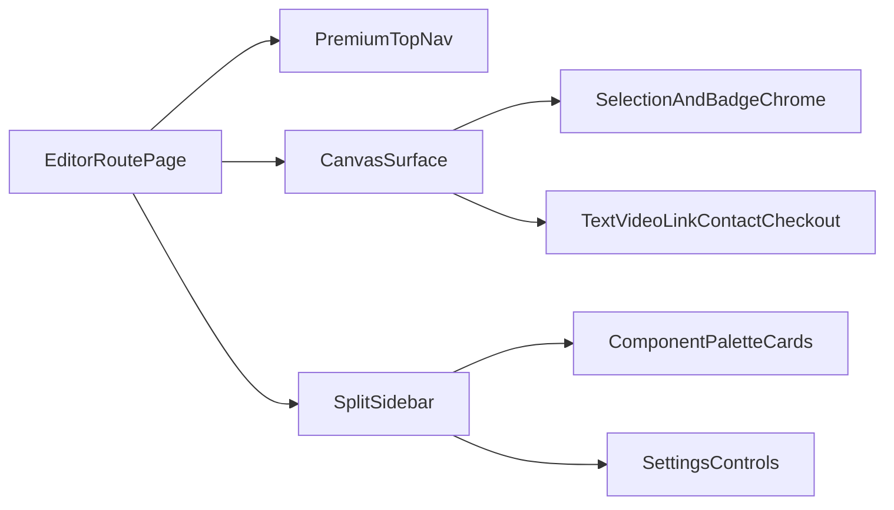

# Premium Funnel Builder UI Polish Plan

## Outcome

Deliver a clean, Shopify-inspired premium visual refresh for the funnel builder **UI only** (no business logic or API behavior changes), covering editor shell + panel internals + rendered builder elements.

## Scope Confirmed

- Full builder UI: editor chrome + sidebar internals + rendered element visuals.
- Depth: fast skin pass (layout/spacing/typography/elevation/visual hierarchy), not a deep interaction rewrite.

## Current Baseline To Improve

- Canvas width/offset is hardcoded in the editor (`mr-[385px]`) in `[/home/amansharma/Desktop/DevOPS/web-builder-test-app/src/app/(main)/subaccount/[subaccountId]/funnels/[funnelId]/editor/[funnelPageId]/_components/funnel-editor/index.tsx](/home/amansharma/Desktop/DevOPS/web-builder-test-app/src/app/(main)`/subaccount/[subaccountId]/funnels/[funnelId]/editor/[funnelPageId]/_components/funnel-editor/index.tsx).
- Editor shell uses fixed full-viewport composition in `[/home/amansharma/Desktop/DevOPS/web-builder-test-app/src/app/(main)/subaccount/[subaccountId]/funnels/[funnelId]/editor/[funnelPageId]/page.tsx](/home/amansharma/Desktop/DevOPS/web-builder-test-app/src/app/(main)`/subaccount/[subaccountId]/funnels/[funnelId]/editor/[funnelPageId]/page.tsx), with nav/sidebar/canvas visual mismatch.
- Sidebar tabs/settings/components are functionally rich but visually inconsistent in `[/home/amansharma/Desktop/DevOPS/web-builder-test-app/src/app/(main)/subaccount/[subaccountId]/funnels/[funnelId]/editor/[funnelPageId]/_components/funnel-editor-sidebar/index.tsx](/home/amansharma/Desktop/DevOPS/web-builder-test-app/src/app/(main)`/subaccount/[subaccountId]/funnels/[funnelId]/editor/[funnelPageId]/_components/funnel-editor-sidebar/index.tsx) and `[/home/amansharma/Desktop/DevOPS/web-builder-test-app/src/app/(main)/subaccount/[subaccountId]/funnels/[funnelId]/editor/[funnelPageId]/_components/funnel-editor-sidebar/tabs/settings-tab.tsx](/home/amansharma/Desktop/DevOPS/web-builder-test-app/src/app/(main)`/subaccount/[subaccountId]/funnels/[funnelId]/editor/[funnelPageId]/_components/funnel-editor-sidebar/tabs/settings-tab.tsx).
- Rendered elements still show utility-level editing borders/badges that look dev-like in `[/home/amansharma/Desktop/DevOPS/web-builder-test-app/src/app/(main)/subaccount/[subaccountId]/funnels/[funnelId]/editor/[funnelPageId]/_components/funnel-editor/funnel-editor-components/container.tsx](/home/amansharma/Desktop/DevOPS/web-builder-test-app/src/app/(main)`/subaccount/[subaccountId]/funnels/[funnelId]/editor/[funnelPageId]/_components/funnel-editor/funnel-editor-components/container.tsx), `[/home/amansharma/Desktop/DevOPS/web-builder-test-app/src/app/(main)/subaccount/[subaccountId]/funnels/[funnelId]/editor/[funnelPageId]/_components/funnel-editor/funnel-editor-components/text.tsx](/home/amansharma/Desktop/DevOPS/web-builder-test-app/src/app/(main)`/subaccount/[subaccountId]/funnels/[funnelId]/editor/[funnelPageId]/_components/funnel-editor/funnel-editor-components/text.tsx), `[/home/amansharma/Desktop/DevOPS/web-builder-test-app/src/app/(main)/subaccount/[subaccountId]/funnels/[funnelId]/editor/[funnelPageId]/_components/funnel-editor/funnel-editor-components/link-component.tsx](/home/amansharma/Desktop/DevOPS/web-builder-test-app/src/app/(main)`/subaccount/[subaccountId]/funnels/[funnelId]/editor/[funnelPageId]/_components/funnel-editor/funnel-editor-components/link-component.tsx), `[/home/amansharma/Desktop/DevOPS/web-builder-test-app/src/app/(main)/subaccount/[subaccountId]/funnels/[funnelId]/editor/[funnelPageId]/_components/funnel-editor/funnel-editor-components/video.tsx](/home/amansharma/Desktop/DevOPS/web-builder-test-app/src/app/(main)`/subaccount/[subaccountId]/funnels/[funnelId]/editor/[funnelPageId]/_components/funnel-editor/funnel-editor-components/video.tsx), `[/home/amansharma/Desktop/DevOPS/web-builder-test-app/src/app/(main)/subaccount/[subaccountId]/funnels/[funnelId]/editor/[funnelPageId]/_components/funnel-editor/funnel-editor-components/contact-form-component.tsx](/home/amansharma/Desktop/DevOPS/web-builder-test-app/src/app/(main)`/subaccount/[subaccountId]/funnels/[funnelId]/editor/[funnelPageId]/_components/funnel-editor/funnel-editor-components/contact-form-component.tsx), and `[/home/amansharma/Desktop/DevOPS/web-builder-test-app/src/app/(main)/subaccount/[subaccountId]/funnels/[funnelId]/editor/[funnelPageId]/_components/funnel-editor/funnel-editor-components/checkout.tsx](/home/amansharma/Desktop/DevOPS/web-builder-test-app/src/app/(main)`/subaccount/[subaccountId]/funnels/[funnelId]/editor/[funnelPageId]/_components/funnel-editor/funnel-editor-components/checkout.tsx).

## Execution Steps

1. **Create a premium visual token layer (fast skin, no architecture rewrite)**
  - Tune color hierarchy, border contrast, elevation, and surface depth in `[/home/amansharma/Desktop/DevOPS/web-builder-test-app/src/app/globals.css](/home/amansharma/Desktop/DevOPS/web-builder-test-app/src/app/globals.css)`.
  - Add/adjust Tailwind extensions (editor-specific shadows/radii/spacing helpers) in `[/home/amansharma/Desktop/DevOPS/web-builder-test-app/tailwind.config.ts](/home/amansharma/Desktop/DevOPS/web-builder-test-app/tailwind.config.ts)`.
2. **Polish editor shell layout and hierarchy**
  - Refresh top navigation spacing, icon button styles, typographic hierarchy, and sticky visual structure in `[/home/amansharma/Desktop/DevOPS/web-builder-test-app/src/app/(main)/subaccount/[subaccountId]/funnels/[funnelId]/editor/[funnelPageId]/_components/funnel-editor-navigation.tsx](/home/amansharma/Desktop/DevOPS/web-builder-test-app/src/app/(main)`/subaccount/[subaccountId]/funnels/[funnelId]/editor/[funnelPageId]/_components/funnel-editor-navigation.tsx).
  - Replace brittle canvas right margin coupling with cleaner shell/canvas width behavior in `[/home/amansharma/Desktop/DevOPS/web-builder-test-app/src/app/(main)/subaccount/[subaccountId]/funnels/[funnelId]/editor/[funnelPageId]/_components/funnel-editor/index.tsx](/home/amansharma/Desktop/DevOPS/web-builder-test-app/src/app/(main)`/subaccount/[subaccountId]/funnels/[funnelId]/editor/[funnelPageId]/_components/funnel-editor/index.tsx) and `[/home/amansharma/Desktop/DevOPS/web-builder-test-app/src/app/(main)/subaccount/[subaccountId]/funnels/[funnelId]/editor/[funnelPageId]/page.tsx](/home/amansharma/Desktop/DevOPS/web-builder-test-app/src/app/(main)`/subaccount/[subaccountId]/funnels/[funnelId]/editor/[funnelPageId]/page.tsx).
  - Modernize sidebar surfaces (icon rail + main panel) for a premium split-pane look in `[/home/amansharma/Desktop/DevOPS/web-builder-test-app/src/app/(main)/subaccount/[subaccountId]/funnels/[funnelId]/editor/[funnelPageId]/_components/funnel-editor-sidebar/index.tsx](/home/amansharma/Desktop/DevOPS/web-builder-test-app/src/app/(main)`/subaccount/[subaccountId]/funnels/[funnelId]/editor/[funnelPageId]/_components/funnel-editor-sidebar/index.tsx).
3. **Upgrade sidebar internals for cleaner builder ergonomics**
  - Improve tab rail affordances and active states in `[/home/amansharma/Desktop/DevOPS/web-builder-test-app/src/app/(main)/subaccount/[subaccountId]/funnels/[funnelId]/editor/[funnelPageId]/_components/funnel-editor-sidebar/tabs/index.tsx](/home/amansharma/Desktop/DevOPS/web-builder-test-app/src/app/(main)`/subaccount/[subaccountId]/funnels/[funnelId]/editor/[funnelPageId]/_components/funnel-editor-sidebar/tabs/index.tsx).
  - Redesign component palette cards and labels in `[/home/amansharma/Desktop/DevOPS/web-builder-test-app/src/app/(main)/subaccount/[subaccountId]/funnels/[funnelId]/editor/[funnelPageId]/_components/funnel-editor-sidebar/tabs/components-tab/index.tsx](/home/amansharma/Desktop/DevOPS/web-builder-test-app/src/app/(main)`/subaccount/[subaccountId]/funnels/[funnelId]/editor/[funnelPageId]/_components/funnel-editor-sidebar/tabs/components-tab/index.tsx) and placeholder files under `[/home/amansharma/Desktop/DevOPS/web-builder-test-app/src/app/(main)/subaccount/[subaccountId]/funnels/[funnelId]/editor/[funnelPageId]/_components/funnel-editor-sidebar/tabs/components-tab](/home/amansharma/Desktop/DevOPS/web-builder-test-app/src/app/(main)`/subaccount/[subaccountId]/funnels/[funnelId]/editor/[funnelPageId]/_components/funnel-editor-sidebar/tabs/components-tab).
  - Improve settings panel control rhythm (labels, grouping, spacing) in `[/home/amansharma/Desktop/DevOPS/web-builder-test-app/src/app/(main)/subaccount/[subaccountId]/funnels/[funnelId]/editor/[funnelPageId]/_components/funnel-editor-sidebar/tabs/settings-tab.tsx](/home/amansharma/Desktop/DevOPS/web-builder-test-app/src/app/(main)`/subaccount/[subaccountId]/funnels/[funnelId]/editor/[funnelPageId]/_components/funnel-editor-sidebar/tabs/settings-tab.tsx).
4. **Polish canvas element chrome (edit-mode visuals)**
  - Standardize selection border, badges, delete handles, hover rings, and spacing rhythm across element components:
    - `[/home/amansharma/Desktop/DevOPS/web-builder-test-app/src/app/(main)/subaccount/[subaccountId]/funnels/[funnelId]/editor/[funnelPageId]/_components/funnel-editor/funnel-editor-components/container.tsx](/home/amansharma/Desktop/DevOPS/web-builder-test-app/src/app/(main)`/subaccount/[subaccountId]/funnels/[funnelId]/editor/[funnelPageId]/_components/funnel-editor/funnel-editor-components/container.tsx)
    - `[/home/amansharma/Desktop/DevOPS/web-builder-test-app/src/app/(main)/subaccount/[subaccountId]/funnels/[funnelId]/editor/[funnelPageId]/_components/funnel-editor/funnel-editor-components/text.tsx](/home/amansharma/Desktop/DevOPS/web-builder-test-app/src/app/(main)`/subaccount/[subaccountId]/funnels/[funnelId]/editor/[funnelPageId]/_components/funnel-editor/funnel-editor-components/text.tsx)
    - `[/home/amansharma/Desktop/DevOPS/web-builder-test-app/src/app/(main)/subaccount/[subaccountId]/funnels/[funnelId]/editor/[funnelPageId]/_components/funnel-editor/funnel-editor-components/link-component.tsx](/home/amansharma/Desktop/DevOPS/web-builder-test-app/src/app/(main)`/subaccount/[subaccountId]/funnels/[funnelId]/editor/[funnelPageId]/_components/funnel-editor/funnel-editor-components/link-component.tsx)
    - `[/home/amansharma/Desktop/DevOPS/web-builder-test-app/src/app/(main)/subaccount/[subaccountId]/funnels/[funnelId]/editor/[funnelPageId]/_components/funnel-editor/funnel-editor-components/video.tsx](/home/amansharma/Desktop/DevOPS/web-builder-test-app/src/app/(main)`/subaccount/[subaccountId]/funnels/[funnelId]/editor/[funnelPageId]/_components/funnel-editor/funnel-editor-components/video.tsx)
5. **Polish rendered funnel component presentation**
  - Make contact and checkout blocks feel premium/clean inside the builder canvas while preserving current behavior in:
    - `[/home/amansharma/Desktop/DevOPS/web-builder-test-app/src/app/(main)/subaccount/[subaccountId]/funnels/[funnelId]/editor/[funnelPageId]/_components/funnel-editor/funnel-editor-components/contact-form-component.tsx](/home/amansharma/Desktop/DevOPS/web-builder-test-app/src/app/(main)`/subaccount/[subaccountId]/funnels/[funnelId]/editor/[funnelPageId]/_components/funnel-editor/funnel-editor-components/contact-form-component.tsx)
    - `[/home/amansharma/Desktop/DevOPS/web-builder-test-app/src/app/(main)/subaccount/[subaccountId]/funnels/[funnelId]/editor/[funnelPageId]/_components/funnel-editor/funnel-editor-components/checkout.tsx](/home/amansharma/Desktop/DevOPS/web-builder-test-app/src/app/(main)`/subaccount/[subaccountId]/funnels/[funnelId]/editor/[funnelPageId]/_components/funnel-editor/funnel-editor-components/checkout.tsx)
    - `[/home/amansharma/Desktop/DevOPS/web-builder-test-app/src/components/forms/contact-form.tsx](/home/amansharma/Desktop/DevOPS/web-builder-test-app/src/components/forms/contact-form.tsx)`
6. **UI QA, responsiveness, and docs hygiene**
  - Validate desktop/tablet/mobile preview visual quality and interaction parity in editor mode and live route `[/home/amansharma/Desktop/DevOPS/web-builder-test-app/src/app/[domain]/[path]/page.tsx](/home/amansharma/Desktop/DevOPS/web-builder-test-app/src/app/[domain]/[path]/page.tsx)`.
  - Run lint checks on edited files and do a focused visual pass for hover/focus/contrast consistency.
  - Update relevant documentation/changelog entry for the builder UI refresh per workspace rules.

## Visual Architecture (Target)

## Implementation Notes

- Keep reducer/actions/state contracts unchanged in `[/home/amansharma/Desktop/DevOPS/web-builder-test-app/src/providers/editor/editor-provider.tsx](/home/amansharma/Desktop/DevOPS/web-builder-test-app/src/providers/editor/editor-provider.tsx)`.
- Keep all polish class-driven and token-driven; avoid API/data-layer changes.

